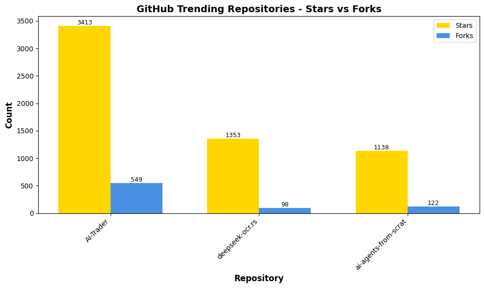

# 🧠 Welcome to my Cyber Space

**A living dashboard for my open-source projects, automations, and analytics.**

<b>📊 System Overview</b>

| Metric | Status |
|--------|--------|
| Active Repos | 13 |
| CI/CD Workflows | 5 |
| Connected Agents | In Development |
| Last Sync | <!-- LAST_SYNC -->Auto-updated daily<!-- /LAST_SYNC --> |

---

## 📅 Daily Brief

<!-- BEGIN DAILY BRIEF -->

<b>📰 Today's Intelligence Brief</b>

# 📅 Daily Brief

**Wednesday, October 29, 2025**

---

<b>💭 Quote of the Day</b>

### 💭 Quote of the Day

> "We are always complaining that our days are few, and acting as though there would be no end of them.  "
>
> — **Seneca**

<b>🌤️ Weather Report</b>

## 🌤️ Weather Report

**Location:** San Juan, Puerto Rico

☀️ **Current Conditions:**
- Temperature: 80°F
- Humidity: 83%
- Wind Speed: 5 mph

**Today's Forecast:**
- High: 94°F / Low: 80°F
- Precipitation: 0.004 in

---

## 🌌 Space Weather Status

**KP Index:** 1.0 (🟢 Quiet)

**Recent Alerts:**
- Space Weather Message Code: ALTK05
Serial Number: 1854
Issue Time: 2025 Sep 29 1720 UTC

ALER...
- Space Weather Message Code: ALTK05
Serial Number: 1854
Issue Time: 2025 Sep 29 1200 UTC

ALER...
- Space Weather Message Code: WARK05
Serial Number: 2103
Issue Time: 2025 Sep 29 1159 UTC

WARN...

<b>📰 Global Intelligence News</b>

**Intel data unavailable** ⛔

_Error: Object of type datetime is not JSON serializable_

<b>🔐 Cyber Pulse Report</b>

**CyberPulse data unavailable** ⛔

_Error: Object of type datetime is not JSON serializable_

<b>🔥 Trending on GitHub</b>

## 🔥 Trending on GitHub

| Repo | Author | Description | Language | Stars | Forks | Link |
|------|--------|-------------|----------|-------|-------|------|
| AI-Trader | HKUDS | "AI-Trader: Can AI Beat the Market?" Live Trading: https://h... | Python | ⭐ 3413 | 🔱 549 | [View](https://github.com/HKUDS/AI-Trader) |
| deepseek-ocr.rs | TimmyOVO | Rust implementation of DeepSeek-OCR with OpenAI-compatible s... | Rust | ⭐ 1353 | 🔱 98 | [View](https://github.com/TimmyOVO/deepseek-ocr.rs) |
| ai-agents-from-scratch | pguso | Demystify AI agents by building them yourself. Local LLMs, n... | JavaScript | ⭐ 1138 | 🔱 122 | [View](https://github.com/pguso/ai-agents-from-scratch) |

---

_Generated at 06:04 AM _

<!-- END DAILY BRIEF -->

---

## 📝 Latest Blog Posts

<b>Click to view recent Gists & Posts</b>

<!-- GISTS_START -->
| Date | Title | Summary | Source |
|------|-------|---------|--------|
| 2025-09-23 | PR‑CYBR: WatchDog's Veteran Transition Program | A glimpse into our WatchDog transition program | [View Gist](https://gist.github.com/cywf/db19af3af790469e2715777c5f19250c) |
| 2025-06-19 | Cursor AI – Rules for AI – General Settings | Outlining general settings for responsible AI interactions | [View Gist](https://gist.github.com/cywf/a620a43424d47f1fb746638a11924cae) |
| 2025-06-17 | General use template for the .cursorrules file | A template for customizing Cursor AI behavior | [View Gist](https://gist.github.com/cywf/601a521551f659ab75b5a6146d4d8e72) |
| 2025-02-06 | Guide for maintaining and configuring Proxmox | Tips on keeping your Proxmox infrastructure running smoothly | [View Gist](https://gist.github.com/cywf/973f9180ae6036e5bcd06eb85aac7c2c) |
<!-- GISTS_END -->

_This section auto-updates nightly via automation._

---

## 🚀 Project Matrix

<b>Click to view CI/CD Metrics & Status</b>

<!-- PROJECT_MATRIX_START -->
| Project | Description | Test | Link |
|---------|-------------|------|------|
| **FortiPath** | Advanced network path analysis with ML |  | [View →](https://github.com/cywf/FortiPath) |
| **sentinel-project** | Autonomous threat detection system |  | [View →](https://github.com/cywf/sentinel-project) |
| **AegisNet** | AI-driven secure network architecture |  | [View →](https://github.com/cywf/AegisNet) |
| **AirwayAtlas** | Airway network visualization with GIS |  | [View →](https://github.com/cywf/AirwayAtlas) |
| **willow** | Multi-agent orchestration framework |  | [View →](https://github.com/cywf/willow) |
| **OTG-TAK** | Tactical awareness kit for operations |  | [View →](https://github.com/cywf/OTG-TAK) |
| **InfraGuard** | Infrastructure monitoring & hardening |  | [View →](https://github.com/cywf/InfraGuard) |
| **NetNinja** | Network reconnaissance & automation |  | [View →](https://github.com/cywf/NetNinja) |
| **ZeroTier-Toolkit** | ZeroTier network management tools |  | [View →](https://github.com/cywf/ZeroTier-Toolkit) |
| **AlphaNest** | Secure collaboration platform |  | [View →](https://github.com/cywf/AlphaNest) |
| **Boilerplates** | Project templates & scaffolding |  | [View →](https://github.com/cywf/Boilerplates) |
| **CTF-Kit** | Capture The Flag tools & utilities |  | [View →](https://github.com/cywf/CTF-Kit) |
| **cywf.github.io** | Personal website & portfolio |  | [View →](https://github.com/cywf/cywf.github.io) |
<!-- PROJECT_MATRIX_END -->

_This table updates nightly via automation._

---

## 📊 Developer Analytics

<b>Click to view GitHub Statistics & Activity</b>

### GitHub Stats

### Contribution Streak

### Top Languages

### Activity Graph

### Profile Summary

---

## 🧠 Learning & Interests

<b>Click to view current focus areas</b>

I'm constantly exploring new horizons across multiple domains:

### 🔐 Cybersecurity & AI/ML
- Defensive automation and threat intelligence
- Ethical hacking and penetration testing
- Generative models and adversarial ML
- Zero-trust architecture implementation

### 🌐 PR-CYBR & Community
- Building resilience in communities
- WatchDog veteran transition programs
- Knowledge sharing and education
- Open-source security tooling

### 🌍 G8 System
- Sustainable legacy frameworks
- Intergenerational knowledge transfer
- Resilience and stewardship models

### 🚀 Space Systems & Quantum
- Satellite communications
- Quantum computing fundamentals
- Energy systems optimization
- Aviation and aerospace technology

### 🧬 Psionics & Consciousness
- Resonance and vibration studies
- Human potential exploration
- Consciousness research
- Mind-body integration

---

_README auto-updated daily by CI workflow • Last update: <!-- UPDATE_TIME -->2025-11-01 15:21 UTC<!-- /UPDATE_TIME -->_

**Stay curious, secure, and ready for adventure** 🚀

### Live Site

🌐 **https://cywf.github.io/cywf/**

