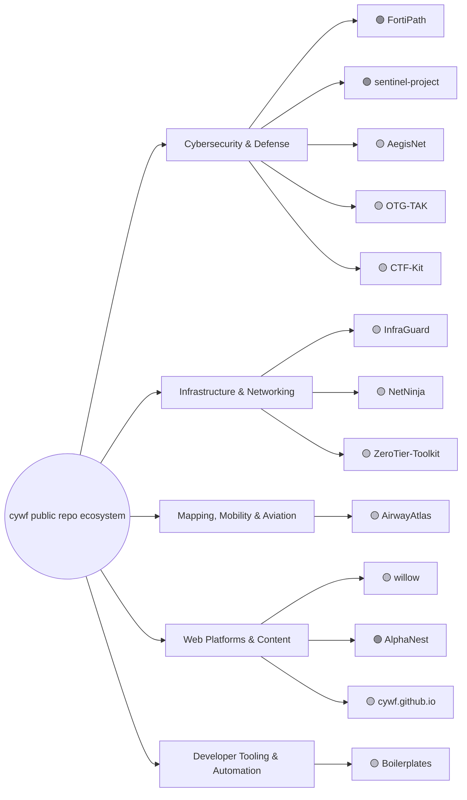

# 🧠 Welcome to my Cyber Space

**A living dashboard for my public open-source projects, automations, and analytics.**

<b>📊 System Overview</b>

A public-repo-only snapshot of the cywf ecosystem: what is active, what needs attention, and how the projects cluster together.

<!-- START: SYSTEM_OVERVIEW -->
| Metric | Status |
|--------|--------|
| Public repos tracked | 13 |
| Working repos | 3 |
| Semi-functioning repos | 10 |
| Broken repos | 0 |
| Repos with substantive public CI | 10 |
| Open blocker issues | 0 |
| Primary language mix | Astro, JavaScript, Python, Rust, Shell, TypeScript |
| Portfolio themes | Cybersecurity & Defense • Developer Tooling & Automation • Infrastructure & Networking • Mapping, Mobility & Aviation • Web Platforms & Content |
| Last ecosystem refresh | 2026-07-05 22:53 UTC |
<!-- END: SYSTEM_OVERVIEW -->

<!-- START: REPO_MERMAID -->

<b>🗺️ Public Repo Ecosystem Graph</b>

```mermaid
flowchart LR
  root((cywf public repo ecosystem))
  root --> CybersecurityDefense[Cybersecurity & Defense]
  CybersecurityDefense --> FortiPath[🟢 FortiPath]
  CybersecurityDefense --> sentinel-project[🟢 sentinel-project]
  CybersecurityDefense --> AegisNet[🟡 AegisNet]
  CybersecurityDefense --> OTG-TAK[🟡 OTG-TAK]
  CybersecurityDefense --> CTF-Kit[🟡 CTF-Kit]
  root --> InfrastructureNetworking[Infrastructure & Networking]
  InfrastructureNetworking --> InfraGuard[🟡 InfraGuard]
  InfrastructureNetworking --> NetNinja[🟡 NetNinja]
  InfrastructureNetworking --> ZeroTier-Toolkit[🟡 ZeroTier-Toolkit]
  root --> MappingMobilityAviation[Mapping, Mobility & Aviation]
  MappingMobilityAviation --> AirwayAtlas[🟡 AirwayAtlas]
  root --> WebPlatformsContent[Web Platforms & Content]
  WebPlatformsContent --> willow[🟡 willow]
  WebPlatformsContent --> AlphaNest[🟢 AlphaNest]
  WebPlatformsContent --> cywf.github.io[🟡 cywf.github.io]
  root --> DeveloperToolingAutomation[Developer Tooling & Automation]
  DeveloperToolingAutomation --> Boilerplates[🟡 Boilerplates]
```

### Attention queue
- **ZeroTier-Toolkit** — last push 252 days ago
- **Boilerplates** — last push 252 days ago
- **NetNinja** — last push 251 days ago

<!-- END: REPO_MERMAID -->

---

## 📝 Latest Blog Posts

<b>Click to view recent Daily Di-Gists</b>

These entries are generated from the scheduled public-repo Daily Di-Gist workflow and summarize the last 24 hours of public repo progress, breakages, health, and next steps.

<!-- START: LATEST_POSTS -->
| Date | Title | Summary | Source |
|------|-------|---------|--------|
| 2026-07-05 | Daily Di-Gist — 2026-07-05 | Public repos reviewed: 13. 0 commits observed. 0 workflow failures observed. | [View Digest](daily/2026-07-05.md) |
<!-- END: LATEST_POSTS -->

_This section auto-updates from the Daily Di-Gist workflow._

---

## 🚀 Project M3trix

<b>Click to view public repo health by status category</b>

This matrix groups public repositories into working, semi-functioning, and broken buckets based on public workflow visibility, open issue blockages, and recent push activity.

<!-- START: PROJECT_MATRIX -->
| Status | Count | Meaning |
|--------|-------|---------|
| Working | 3 | Public CI present and no obvious portfolio-level blocker signal |
| Semi-functioning | 10 | Stale pushes, missing substantive CI, or disabled workflow signals |
| Broken | 0 | Archived repo or open blocker issue combined with disabled workflow |
<!-- END: PROJECT_MATRIX -->

<b>🟢 Working repositories (3)</b>

| Project | What it does | Workflow | Status signal | Blockage |
|---------|---------------|----------|---------------|----------|
| **[FortiPath](https://github.com/cywf/FortiPath)** | FortiPath: a comprehensive executive protection tool designed to enha… |  | Deployment Automation • 166d since push | None |
| **[sentinel-project](https://github.com/cywf/sentinel-project)** | Advanced security system for critical infrastructure with threat inte… |  | CI/CD Pipeline • 170d since push | None |
| **[AlphaNest](https://github.com/cywf/AlphaNest)** | Secure collaboration platform. |  | Build and Test Containers • 161d since push | None |

<b>🟡 Semi-functioning repositories (10)</b>

| Project | What it does | Workflow | Status signal | Blockage |
|---------|---------------|----------|---------------|----------|
| **[AegisNet](https://github.com/cywf/AegisNet)** | Integrated defense solution using AI, autonomous drones, and advanced… |  | Docker Build and Push • 245d since push | None |
| **[AirwayAtlas](https://github.com/cywf/AirwayAtlas)** | Airport city data platform with interactive map, search, and API for… |  | Security • 245d since push | None |
| **[willow](https://github.com/cywf/willow)** | Blockchain-based real estate website inspired by Zillow. |  | Deploy to GitHub Pages • 245d since push | None |
| **[OTG-TAK](https://github.com/cywf/otg-tak)** | On-The-Go TAK deployment tooling for tactical operations. |  | Test • 245d since push | None |
| **[InfraGuard](https://github.com/cywf/Infraguard)** | Automated server provisioning and configuration scripts for secure in… |  | Terraform Validation • 244d since push | None |
| **[NetNinja](https://github.com/cywf/netninja)** | Linux server troubleshooting automation for network and system admins. | — | No public CI • 251d since push | None |
| **[ZeroTier-Toolkit](https://github.com/cywf/zerotier-toolkit)** | Toolkit for building, configuring, deploying, and troubleshooting Zer… | — | No public CI • 252d since push | None |
| **[Boilerplates](https://github.com/cywf/boilerplates)** | Personal template collection for tools and technologies. | — | No public CI • 252d since push | None |
| **[CTF-Kit](https://github.com/cywf/ctf-kit)** | Capture-the-Flag starter kit. |  | Validate Contributions • 245d since push | None |
| **[cywf.github.io](https://github.com/cywf/cywf.github.io)** | Personal website and blog hosted on GitHub Pages. |  | Deploy Astro site to Pages • 239d since push | None |

<b>🔴 Broken repositories (0)</b>

_None in this category right now._

---

## 📊 Developer Analytics

<b>Click to view GitHub statistics & activity</b>

### GitHub Stats

### Contribution Streak

### Top Languages

### Activity Graph

### Profile Summary

---

## 🧠 Learning & Interests

<b>Click to view themes inferred from current public repos</b>

This section is generated strictly from the current public repository portfolio — not from generic interest statements.

<!-- START: LEARNING_DYNAMIC -->
### Focus areas inferred from current public projects

- **Cybersecurity & Defense** — [FortiPath](https://github.com/cywf/FortiPath), [sentinel-project](https://github.com/cywf/sentinel-project), [AegisNet](https://github.com/cywf/AegisNet), [OTG-TAK](https://github.com/cywf/otg-tak), [CTF-Kit](https://github.com/cywf/ctf-kit)
- **Infrastructure & Networking** — [FortiPath](https://github.com/cywf/FortiPath), [sentinel-project](https://github.com/cywf/sentinel-project), [InfraGuard](https://github.com/cywf/Infraguard), [NetNinja](https://github.com/cywf/netninja), [ZeroTier-Toolkit](https://github.com/cywf/zerotier-toolkit)
- **Web Platforms & Content** — [willow](https://github.com/cywf/willow), [AlphaNest](https://github.com/cywf/AlphaNest), [cywf.github.io](https://github.com/cywf/cywf.github.io)
- **Developer Tooling & Automation** — [NetNinja](https://github.com/cywf/netninja), [ZeroTier-Toolkit](https://github.com/cywf/zerotier-toolkit), [Boilerplates](https://github.com/cywf/boilerplates)
- **Mapping, Mobility & Aviation** — [AegisNet](https://github.com/cywf/AegisNet), [AirwayAtlas](https://github.com/cywf/AirwayAtlas)

### Technology mix

- **Languages in active public portfolio:** TypeScript (4), Astro (3), Python (2), JavaScript (2), Rust (1), Shell (1)
- **Projects tracked:** 13

### Recently touched public repos

| Repo | Primary language | Theme | Last public push |
|------|------------------|-------|------------------|
| [AlphaNest](https://github.com/cywf/AlphaNest) | TypeScript | Web Platforms & Content | 161 days ago |
| [FortiPath](https://github.com/cywf/FortiPath) | Python | Cybersecurity & Defense | 166 days ago |
| [sentinel-project](https://github.com/cywf/sentinel-project) | TypeScript | Cybersecurity & Defense | 170 days ago |
| [cywf.github.io](https://github.com/cywf/cywf.github.io) | Astro | Web Platforms & Content | 239 days ago |
| [InfraGuard](https://github.com/cywf/Infraguard) | TypeScript | Infrastructure & Networking | 244 days ago |
<!-- END: LEARNING_DYNAMIC -->

---

## 🌟 GitHub Showcase

<b>Click to view today's top 3 trending repositories</b>

<!-- START: GH_SHOWCASE -->
| Rank | Repository | Language | Stars today | Description |
|------|------------|----------|-------------|-------------|
| 1 | [Zackriya-Solutions/meetily](https://github.com/Zackriya-Solutions/meetily) | Rust | 1,409 stars today | Privacy first, AI meeting assistant with 4x faster Parakeet/Whisper live transcription, speaker dia… |
| 2 | [openai/codex-plugin-cc](https://github.com/openai/codex-plugin-cc) | JavaScript | 1,519 stars today | Use Codex from Claude Code to review code or delegate tasks. |
| 3 | [asgeirtj/system_prompts_leaks](https://github.com/asgeirtj/system_prompts_leaks) | JavaScript | 981 stars today | Extracted system prompts from Anthropic - Claude Fable 5, Opus 4.8, Claude Code, Claude Design. Ope… |
<!-- END: GH_SHOWCASE -->

---

_README auto-updated daily by CI workflow • Last update: <!-- UPDATE_TIME -->2026-07-05 23:09 UTC<!-- /UPDATE_TIME --> • Gists sync: <!-- LAST_SYNC -->2026-07-05 22:52 UTC<!-- /LAST_SYNC -->_

**Stay curious, secure, and ready for adventure** 🚀

🌐 **[https://cywf.github.io/cywf/](https://cywf.github.io)**

