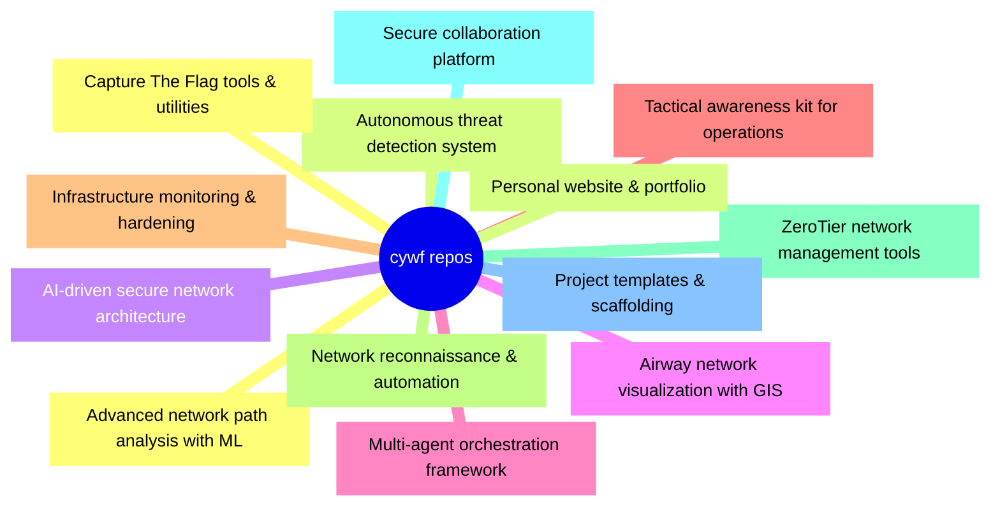

# 🧠 Welcome to my Cyber Space

**A living dashboard for my open-source projects, automations, and analytics.**

<b>📊 System Overview</b>

| Metric | Status |
|--------|--------|
| Active Repos | 13 |
| CI/CD Workflows | 9 |
| Connected Agents | Hermes + GitHub Actions |
| Last Sync | <!-- LAST_SYNC -->2026-07-05 22:05 UTC<!-- /LAST_SYNC --> |

---

## 📅 Daily Brief

<!-- BEGIN DAILY BRIEF -->

<b>📰 Today's Intelligence Brief</b>

# 📅 Daily Brief

**[Sunday, July 05, 2026]**

---

<b>💭 Quote of the Day</b>

### 💭 Quote of the Day

> "One of the advantages of being disorganized is that one is always having surprising discoveries."
>
> — **A.A. Milne**

<b>🌤️ Weather Report</b>

### 🌤️ Weather Report

- **Location**: Rifle, Colorado
- **Current Conditions**: 95°F, Humidity: 5%, Wind Speed: 4 mph
- **Today's Forecast**: High 96°F / Low 56°F, Precipitation: 1% ☀️

**Space Weather Status**:
- **KP Index**: Unavailable
- **Recent Alerts**: Space weather feed unavailable.

<b>📰 Global Intelligence News</b>

### 📰 Global Intelligence News

1. **Folarin Balogun available for USMNT vs. Belgium as red card ban suspended - The New York Times**
   Folarin Balogun available for USMNT vs. Belgium as red card ban suspended The New York Times

2. **World Cup 2026 today: Live updates, news as England prepare for biggest challenge yet against Mexico and Norw…**
   World Cup 2026 today: Live updates, news as England prepare for biggest challenge yet against Mexico and Norway face Brazil - July 5 ESPN

3. **Trump thanks FIFA after Folarin Balogun’s World Cup red card suspension is reversed - CNBC**
   Trump thanks FIFA after Folarin Balogun’s World Cup red card suspension is reversed CNBC

<b>🔐 Cyber Pulse Report</b>

### 🔐 Cyber Pulse Report

1. **Navigating NIST’s New Cybersecurity AI Frontier - GovTech**
   Navigating NIST’s New Cybersecurity AI Frontier GovTech

2. **Pennington Co. responding to cybersecurity incident - KELOLAND.com**
   Pennington Co. responding to cybersecurity incident KELOLAND.com

3. **ESA’s CyberCUBE To Launch On 7th July To Open On-orbit Cybersecurity Testbed - Orbital Today**
   ESA’s CyberCUBE To Launch On 7th July To Open On-orbit Cybersecurity Testbed Orbital Today

<b>🔥 Trending on GitHub</b>

### 🔥 Trending on GitHub

| Repo | Author | Description | Language | Stars | Forks | Link |
|------|--------|-------------|----------|-------|-------|------|
| ponytail | DietrichGebert | Makes your AI agent think like the laziest senior dev in the room. The best cod… | JavaScript | 74748 ⭐ | 3932 🔱 | [Link](https://github.com/DietrichGebert/ponytail) |
| Unlimited-OCR | baidu | Unlimited OCR Works: Welcome the Era of One-shot Long-horizon Parsing. | Python | 13349 ⭐ | 1081 🔱 | [Link](https://github.com/baidu/Unlimited-OCR) |
| MiMo-Code | XiaomiMiMo | MiMo Code: Where Models and Agents Co-Evolve | TypeScript | 11469 ⭐ | 1120 🔱 | [Link](https://github.com/XiaomiMiMo/MiMo-Code) |

---

_Generated at 10:06 PM UTC_

<!-- END DAILY BRIEF -->

---

## 📝 Latest Blog Posts

<b>Click to view recent Gists & Posts</b>

<!-- START: LATEST_POSTS -->
| Date | Title | Summary | Source |
|------|-------|---------|--------|
| 2025-09-23 | PR-CYBR: WatchDog's Veteran Transition Program - Introduction | PR-CYBR: WatchDog's Veteran Transition Program - Introduction | [View Gist](https://gist.github.com/cywf/db19af1524556eaeadcc2241dd697a29) |
| 2024-05-31 | Pix4D Combined with RTK GPS for Security Applications | Pix4D Combined with RTK GPS for Security Applications | [View Gist](https://gist.github.com/cywf/e2028faac4b93e5c79fb976e3b4e5b4f) |
| 2024-02-14 | A guide on how to properly and securely setup Bitwarden for iOS and A… | A guide on how to properly and securely setup Bitwarden for iOS and Android Devices | [View Gist](https://gist.github.com/cywf/3a0bc04d80db3093b9743bfa74a804c2) |
| 2024-01-11 | technical-debt.md | No description available | [View Gist](https://gist.github.com/cywf/5048df59015a714dbe95360bd3aab489) |
| 2023-05-26 | Get ready to witness the ultimate power couple: 5G and the cloud. Wit… | Get ready to witness the ultimate power couple: 5G and the cloud. With blazing fast speed… | [View Gist](https://gist.github.com/cywf/b6dbc46036d7cdedc72be853fe851c40) |
<!-- END: LATEST_POSTS -->

_This section auto-updates nightly via automation._

---

## 🚀 Project M3trix

<b> Click or Tap to view Project Analytics & Status</b>

The matrix below is generated from the tracked public repositories and their primary public workflow badges.

<!-- START: PROJECT_MATRIX -->
| Project | Description | Workflow | Link |
|---------|-------------|----------|------|
| **[FortiPath](https://github.com/cywf/FortiPath)** | Advanced network path analysis with ML |  | [Open repo](https://github.com/cywf/FortiPath) |
| **[sentinel-project](https://github.com/cywf/sentinel-project)** | Autonomous threat detection system |  | [Open repo](https://github.com/cywf/sentinel-project) |
| **[AegisNet](https://github.com/cywf/AegisNet)** | AI-driven secure network architecture |  | [Open repo](https://github.com/cywf/AegisNet) |
| **[AirwayAtlas](https://github.com/cywf/AirwayAtlas)** | Airway network visualization with GIS |  | [Open repo](https://github.com/cywf/AirwayAtlas) |
| **[willow](https://github.com/cywf/willow)** | Multi-agent orchestration framework |  | [Open repo](https://github.com/cywf/willow) |
| **[OTG-TAK](https://github.com/cywf/otg-tak)** | Tactical awareness kit for operations |  | [Open repo](https://github.com/cywf/otg-tak) |
| **[InfraGuard](https://github.com/cywf/Infraguard)** | Infrastructure monitoring & hardening |  | [Open repo](https://github.com/cywf/Infraguard) |
| **[NetNinja](https://github.com/cywf/netninja)** | Network reconnaissance & automation | — | [Open repo](https://github.com/cywf/netninja) |
| **[ZeroTier-Toolkit](https://github.com/cywf/zerotier-toolkit)** | ZeroTier network management tools | — | [Open repo](https://github.com/cywf/zerotier-toolkit) |
| **[AlphaNest](https://github.com/cywf/AlphaNest)** | Secure collaboration platform |  | [Open repo](https://github.com/cywf/AlphaNest) |
| **[Boilerplates](https://github.com/cywf/boilerplates)** | Project templates & scaffolding | — | [Open repo](https://github.com/cywf/boilerplates) |
| **[CTF-Kit](https://github.com/cywf/ctf-kit)** | Capture The Flag tools & utilities |  | [Open repo](https://github.com/cywf/ctf-kit) |
| **[cywf.github.io](https://github.com/cywf/cywf.github.io)** | Personal website & portfolio |  | [Open repo](https://github.com/cywf/cywf.github.io) |
<!-- END: PROJECT_MATRIX -->

_This section updates nightly via automation._

---

## 📊 Developer Analytics

<b>Click to view GitHub Statistics & Activity</b>

### GitHub Stats

### Contribution Streak

### Top Languages

### Activity Graph

### Profile Summary

<!-- START: REPO_MERMAID -->

<b>🧭 Repository Map (Mermaid)</b>

```mermaid
mindmap
  root((cywf repos))
    FortiPath[Advanced network path analysis with ML]
    sentinel-project[Autonomous threat detection system]
    AegisNet[AI-driven secure network architecture]
    AirwayAtlas[Airway network visualization with GIS]
    willow[Multi-agent orchestration framework]
    OTG-TAK[Tactical awareness kit for operations]
    InfraGuard[Infrastructure monitoring & hardening]
    NetNinja[Network reconnaissance & automation]
    ZeroTier-Toolkit[ZeroTier network management tools]
    AlphaNest[Secure collaboration platform]
    Boilerplates[Project templates & scaffolding]
    CTF-Kit[Capture The Flag tools & utilities]
    cywf.github.io[Personal website & portfolio]
```

<!-- END: REPO_MERMAID -->

---

## 🧠 Learning & Interests

<b>Click to view current focus areas</b>

I'm constantly exploring new horizons across multiple domains:

### 🔐 Cybersecurity & AI/ML
- Defensive automation and threat intelligence
- Ethical hacking and penetration testing
- Generative models and adversarial ML
- Zero-trust architecture implementation

### 🌐 PR-CYBR & Community
- Building resilience in communities
- WatchDog veteran transition programs
- Knowledge sharing and education
- Open-source security tooling

### 🌍 G8 System
- Sustainable legacy frameworks
- Intergenerational knowledge transfer
- Resilience and stewardship models

### 🚀 Space Systems & Quantum
- Satellite communications
- Quantum computing fundamentals
- Energy systems optimization
- Aviation and aerospace technology

### 🧬 Psionics & Consciousness
- Resonance and vibration studies
- Human potential exploration
- Consciousness research
- Mind-body integration

---

### 📈 Recent Activity (Last 24h)

<!-- START: LEARNING_DYNAMIC -->
_No recent activity detected in the last 24 hours._
<!-- END: LEARNING_DYNAMIC -->

---

## 🌟 GitHub Showcase

<b>Click to view today's trending repositories</b>

<!-- START: GH_SHOWCASE -->
_Trending repositories will be displayed here._
<!-- END: GH_SHOWCASE -->

---

_README auto-updated daily by CI workflow • Last update: <!-- UPDATE_TIME -->2026-07-05 22:06 UTC<!-- /UPDATE_TIME --> • Gists sync: <!-- LAST_SYNC -->2026-07-05 22:05 UTC<!-- /LAST_SYNC -->_

**Stay curious, secure, and ready for adventure** 🚀

🌐 **[https://cywf.github.io/cywf/](https://cywf.github.io)**

