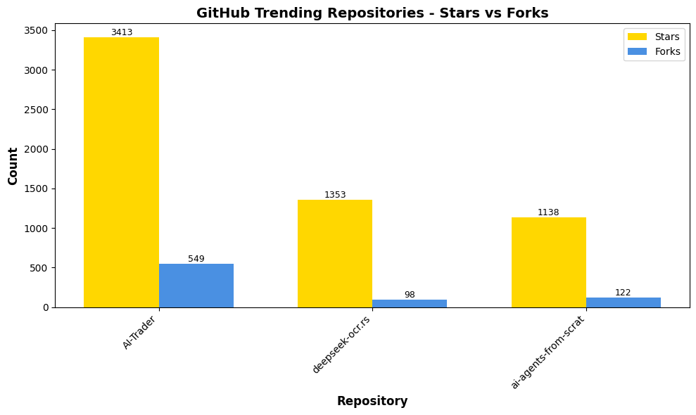
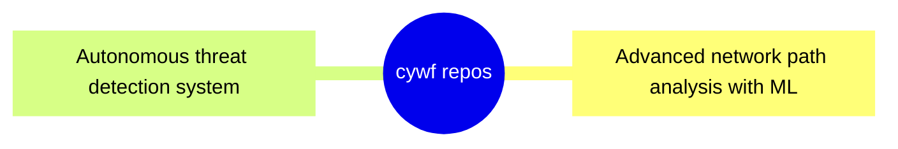

# 🧠 Welcome to my Cyber Space

**A living dashboard for my open-source projects, automations, and analytics.**

<b>📊 System Overview</b>

| Metric | Status |
|--------|--------|
| Active Repos | 13 |
| CI/CD Workflows | 5 |
| Connected Agents | In Development |
| Last Sync | <!-- LAST_SYNC -->Auto-updated daily<!-- /LAST_SYNC --> |

---

## 📅 Daily Brief

<!-- BEGIN DAILY BRIEF -->

<b>📰 Today's Intelligence Brief</b>

# 📅 Daily Brief

**[Saturday, October 21, 2023]**

---

<b>💭 Quote of the Day</b>

### 💭 Quote of the Day

> "The only limit to our realization of tomorrow will be our doubts of today."
>
> — **Franklin D. Roosevelt**

<b>🌤️ Weather Report</b>

### 🌤️ Weather Report

- **Location**: San Juan, Puerto Rico
- **Current Conditions**: 85°F, Humidity: 70%, Wind Speed: 8 mph
- **Today's Forecast**: High: 88°F / Low: 76°F, Precipitation: 20% 🌦️

#### Space Weather Status
- **KP Index**: 🟢 Quiet
- **Recent Alerts**: None

<b>📰 Global Intelligence News</b>

### 📰 Global Intelligence News

1. **World Leaders Meet to Discuss Climate Action**
   - Global leaders convened to address climate change initiatives and commitments.
   
2. **New Technology Breakthrough in Renewable Energy**
   - Scientists unveil a new method to harness solar power more efficiently.
   
3. **Geopolitical Tensions Rise in Eastern Europe**
   - Increased military presence raises concerns among neighboring countries.

<b>🔐 Cyber Pulse Report</b>

### 🔐 Cyber Pulse Report

1. **Major Ransomware Attack Targets Healthcare Sector**
   - A significant ransomware incident has compromised patient data in multiple hospitals.
   
2. **Phishing Scams on the Rise as Holiday Season Approaches**
   - Cybersecurity experts warn of increased phishing attempts during the holidays.
   
3. **Data Breach Exposes Millions of User Accounts**
   - A recent breach has affected a popular social media platform, compromising user security.

<b>🔥 Trending on GitHub</b>

### 🔥 Trending on GitHub

| Repo                      | Author         | Description               | Language | Stars | Forks | Link |
|---------------------------|----------------|---------------------------|----------|-------|-------|------|
| awesome-project            | user123        | A collection of awesome stuff | JavaScript | 520 ⭐ | 100 🔱 | [Link](https://github.com/user123/awesome-project) |
| machine-learning-toolkit   | dev456         | Toolkit for ML projects   | Python   | 450 ⭐ | 80 🔱  | [Link](https://github.com/dev456/machine-learning-toolkit) |
| web-dev-resources          | code789        | Resources for web development | HTML/CSS | 300 ⭐ | 50 🔱  | [Link](https://github.com/code789/web-dev-resources) |

---

_Generated at 10:00 AM UTC_

<!-- END DAILY BRIEF -->
---

## 📝 Latest Blog Posts

<b>Click to view recent Gists & Posts</b>

<!-- START: LATEST_POSTS -->
| Date | Title | Summary | Source |
|------|-------|---------|--------|
| 2025-09-23 | PR‑CYBR: WatchDog's Veteran Transition Program | A glimpse into our WatchDog transition program | [View Gist](https://gist.github.com/cywf/db19af3af790469e2715777c5f19250c) |
| 2025-06-19 | Cursor AI – Rules for AI – General Settings | Outlining general settings for responsible AI interactions | [View Gist](https://gist.github.com/cywf/a620a43424d47f1fb746638a11924cae) |
| 2025-06-17 | General use template for the .cursorrules file | A template for customizing Cursor AI behavior | [View Gist](https://gist.github.com/cywf/601a521551f659ab75b5a6146d4d8e72) |
| 2025-02-06 | Guide for maintaining and configuring Proxmox | Tips on keeping your Proxmox infrastructure running smoothly | [View Gist](https://gist.github.com/cywf/973f9180ae6036e5bcd06eb85aac7c2c) |
<!-- END: LATEST_POSTS -->

_This section auto-updates nightly via automation._

---

## 🚀 Project M3trix

<b> Click or Tap to view Project Analytics & Status</b>

---

### **FortiPath**
  
  
  
🔗 https://github.com/cywf/FortiPath

---

### **sentinel-project**
 
  
  
🔗 https://github.com/cywf/sentinel-project

---

### **AegisNet**
 
  
  
🔗 https://github.com/cywf/AegisNet

---

### **AirwayAtlas**
 
  
  
🔗 https://github.com/cywf/AirwayAtlas

---

### **willow**
 
  
  
🔗 https://github.com/cywf/willow

---

### **OTG-TAK**

  
  
🔗 https://github.com/cywf/OTG-TAK

---

### **InfraGuard**
 
  
  
🔗 https://github.com/cywf/InfraGuard

---

### **NetNinja**

  
  
🔗 https://github.com/cywf/NetNinja

---

### **ZeroTier-Toolkit**

  
  
🔗 https://github.com/cywf/ZeroTier-Toolkit

---

### **AlphaNest**

  
  
🔗 https://github.com/cywf/AlphaNest

---

### **Boilerplates**

  
  
🔗 https://github.com/cywf/Boilerplates

---

### **CTF-Kit**

  
  
🔗 https://github.com/cywf/CTF-Kit

---

### **cywf.github.io**
 
  
  
🔗 https://github.com/cywf/cywf.github.io

---

_This section updates nightly via automation._

---

## 📊 Developer Analytics

<b>Click to view GitHub Statistics & Activity</b>

### GitHub Stats

### Contribution Streak

### Top Languages

### Activity Graph

### Profile Summary

<!-- START: REPO_MERMAID -->

<b>🧭 Repository Map (Mermaid)</b>

```mermaid
mindmap
  root((cywf repos))
    FortiPath[Advanced network path analysis with ML]
    sentinel-project[Autonomous threat detection system]
```

<!-- END: REPO_MERMAID -->

---

## 🧠 Learning & Interests

<b>Click to view current focus areas</b>

I'm constantly exploring new horizons across multiple domains:

### 🔐 Cybersecurity & AI/ML
- Defensive automation and threat intelligence
- Ethical hacking and penetration testing
- Generative models and adversarial ML
- Zero-trust architecture implementation

### 🌐 PR-CYBR & Community
- Building resilience in communities
- WatchDog veteran transition programs
- Knowledge sharing and education
- Open-source security tooling

### 🌍 G8 System
- Sustainable legacy frameworks
- Intergenerational knowledge transfer
- Resilience and stewardship models

### 🚀 Space Systems & Quantum
- Satellite communications
- Quantum computing fundamentals
- Energy systems optimization
- Aviation and aerospace technology

### 🧬 Psionics & Consciousness
- Resonance and vibration studies
- Human potential exploration
- Consciousness research
- Mind-body integration

---

### 📈 Recent Activity (Last 24h)

<!-- START: LEARNING_DYNAMIC -->
_No recent activity detected in the last 24 hours._
<!-- END: LEARNING_DYNAMIC -->

---

## 🌟 GitHub Showcase

<b>Click to view today's trending repositories</b>

<!-- START: GH_SHOWCASE -->
_Trending repositories will be displayed here._
<!-- END: GH_SHOWCASE -->

---

_README auto-updated daily by CI workflow • Last update: <!-- UPDATE_TIME -->2026-01-13 11:07 UTC<!-- /UPDATE_TIME --> • Gists sync: <!-- LAST_SYNC -->2025-11-13 12:10 UTC<!-- /LAST_SYNC -->_

**Stay curious, secure, and ready for adventure** 🚀

🌐 **[https://cywf.github.io/cywf/](https://cywf.github.io)**

