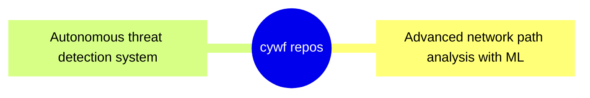

# 🧠 Welcome to my Cyber Space

**A living dashboard for my open-source projects, automations, and analytics.**

<b>📊 System Overview</b>

| Metric | Status |
|--------|--------|
| Active Repos | 13 |
| CI/CD Workflows | 5 |
| Connected Agents | In Development |
| Last Sync | <!-- LAST_SYNC -->Auto-updated daily<!-- /LAST_SYNC --> |

---

## 📅 Daily Brief

<!-- BEGIN DAILY BRIEF -->

<b>📰 Today's Intelligence Brief</b>

**[Friday, October 20, 2023]**

---

<b>💭 Quote of the Day</b>

### 💭 Quote of the Day

> "Success is not final, failure is not fatal: It is the courage to continue that counts."
>
> — **Winston S. Churchill**

<b>🌤️ Weather Report</b>

### 🌤️ Weather Report

**Location:** San Juan, Puerto Rico

- **Current Conditions:** 82°F, Humidity 70%, Wind Speed 10 mph 🌤️
- **Today's Forecast:** High 85°F / Low 78°F, Precipitation 10%

**Space Weather Status:**
- **KP Index:** 🟢 Quiet
- **Recent Alerts:** None

<b>📰 Global Intelligence News</b>

### 📰 Global Intelligence News

1. **World Leaders Gather for Climate Summit**  
   Global leaders are meeting to discuss urgent climate actions and new agreements.

2. **Major Breakthrough in Cancer Research**  
   Scientists announce a promising treatment that could improve survival rates.

3. **Tech Giants Face Antitrust Scrutiny**  
   Regulatory bodies are increasing pressure on major tech companies over monopolistic practices.

<b>🔠Cyber Pulse Report</b>

### 🔐 Cyber Pulse Report

1. **New Ransomware Variant Discovered**  
   A new ransomware variant targets businesses, demanding hefty ransoms.

2. **Data Breach Exposes Millions**  
   A recent breach at a large corporation has compromised sensitive customer data.

3. **Phishing Attacks on the Rise**  
   Cybersecurity experts warn of increasing phishing attempts during the holiday season.

<b>🔥 Trending on GitHub</b>

### 🔥 Trending on GitHub

| Repo                    | Author        | Description                    | Language | Stars | Forks | Link                          |
|-------------------------|---------------|--------------------------------|----------|-------|-------|-------------------------------|
| awesome-project         | user1        | A collection of awesome stuff  | JavaScript | 1.2k ⭐ | 300 🔱 | [View Repo](https://github.com/user1/awesome-project) |
| cool-library            | user2        | A library for cool features    | Python    | 950 ⭐  | 150 🔱 | [View Repo](https://github.com/user2/cool-library)    |
| trendy-app              | user3        | An app that is trending now    | Go        | 800 ⭐  | 125 🔱 | [View Repo](https://github.com/user3/trendy-app)      |

---

_Generated at 12:00 PM UTC_

<!-- END DAILY BRIEF -->

---

## 📝 Latest Blog Posts

<b>Click to view recent Gists & Posts</b>

<!-- START: LATEST_POSTS -->
| Date | Title | Summary | Source |
|------|-------|---------|--------|
| 2025-09-23 | PR‑CYBR: WatchDog's Veteran Transition Program | A glimpse into our WatchDog transition program | [View Gist](https://gist.github.com/cywf/db19af3af790469e2715777c5f19250c) |
| 2025-06-19 | Cursor AI – Rules for AI – General Settings | Outlining general settings for responsible AI interactions | [View Gist](https://gist.github.com/cywf/a620a43424d47f1fb746638a11924cae) |
| 2025-06-17 | General use template for the .cursorrules file | A template for customizing Cursor AI behavior | [View Gist](https://gist.github.com/cywf/601a521551f659ab75b5a6146d4d8e72) |
| 2025-02-06 | Guide for maintaining and configuring Proxmox | Tips on keeping your Proxmox infrastructure running smoothly | [View Gist](https://gist.github.com/cywf/973f9180ae6036e5bcd06eb85aac7c2c) |
<!-- END: LATEST_POSTS -->

_This section auto-updates nightly via automation._

---

## 🚀 Project Matrix

<b>Click to view CI/CD Metrics & Status</b>

<!-- START: PROJECT_MATRIX -->
| Project | Description | Test | Link |
|---------|-------------|------|------|
| **FortiPath** | Advanced network path analysis with ML |  | [View →](https://github.com/cywf/FortiPath) |
| **sentinel-project** | Autonomous threat detection system |  | [View →](https://github.com/cywf/sentinel-project) |
| **AegisNet** | AI-driven secure network architecture |  | [View →](https://github.com/cywf/AegisNet) |
| **AirwayAtlas** | Airway network visualization with GIS |  | [View →](https://github.com/cywf/AirwayAtlas) |
| **willow** | Multi-agent orchestration framework |  | [View →](https://github.com/cywf/willow) |
| **OTG-TAK** | Tactical awareness kit for operations |  | [View →](https://github.com/cywf/OTG-TAK) |
| **InfraGuard** | Infrastructure monitoring & hardening |  | [View →](https://github.com/cywf/InfraGuard) |
| **NetNinja** | Network reconnaissance & automation |  | [View →](https://github.com/cywf/NetNinja) |
| **ZeroTier-Toolkit** | ZeroTier network management tools |  | [View →](https://github.com/cywf/ZeroTier-Toolkit) |
| **AlphaNest** | Secure collaboration platform |  | [View →](https://github.com/cywf/AlphaNest) |
| **Boilerplates** | Project templates & scaffolding |  | [View →](https://github.com/cywf/Boilerplates) |
| **CTF-Kit** | Capture The Flag tools & utilities |  | [View →](https://github.com/cywf/CTF-Kit) |
| **cywf.github.io** | Personal website & portfolio |  | [View →](https://github.com/cywf/cywf.github.io) |
<!-- END: PROJECT_MATRIX -->

_This table updates nightly via automation._

---

## 📊 Developer Analytics

<b>Click to view GitHub Statistics & Activity</b>

### GitHub Stats

### Contribution Streak

### Top Languages

### Activity Graph

### Profile Summary

<!-- START: REPO_MERMAID -->

<b>🧭 Repository Map (Mermaid)</b>

<!-- END: REPO_MERMAID -->

---

## 🧠 Learning & Interests

<b>Click to view current focus areas</b>

I'm constantly exploring new horizons across multiple domains:

### 🔐 Cybersecurity & AI/ML
- Defensive automation and threat intelligence
- Ethical hacking and penetration testing
- Generative models and adversarial ML
- Zero-trust architecture implementation

### 🌐 PR-CYBR & Community
- Building resilience in communities
- WatchDog veteran transition programs
- Knowledge sharing and education
- Open-source security tooling

### 🌍 G8 System
- Sustainable legacy frameworks
- Intergenerational knowledge transfer
- Resilience and stewardship models

### 🚀 Space Systems & Quantum
- Satellite communications
- Quantum computing fundamentals
- Energy systems optimization
- Aviation and aerospace technology

### 🧬 Psionics & Consciousness
- Resonance and vibration studies
- Human potential exploration
- Consciousness research
- Mind-body integration

---

### 📈 Recent Activity (Last 24h)

<!-- START: LEARNING_DYNAMIC -->
_No recent activity detected in the last 24 hours._
<!-- END: LEARNING_DYNAMIC -->

---

## 🌟 GitHub Showcase

<b>Click to view today's trending repositories</b>

<!-- START: GH_SHOWCASE -->
_Trending repositories will be displayed here._
<!-- END: GH_SHOWCASE -->

---

_README auto-updated daily by CI workflow • Last update: <!-- UPDATE_TIME -->2025-11-03 12:10 UTC<!-- /UPDATE_TIME -->_

**Stay curious, secure, and ready for adventure** 🚀

🌐 **https://cywf.github.io/cywf/**

